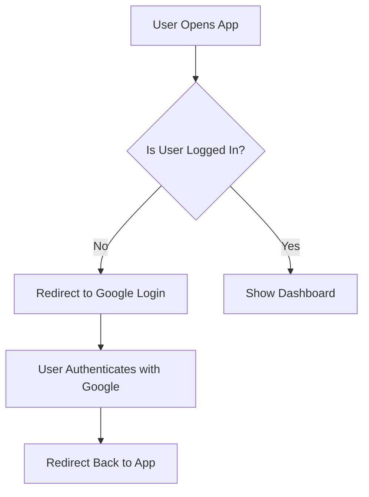
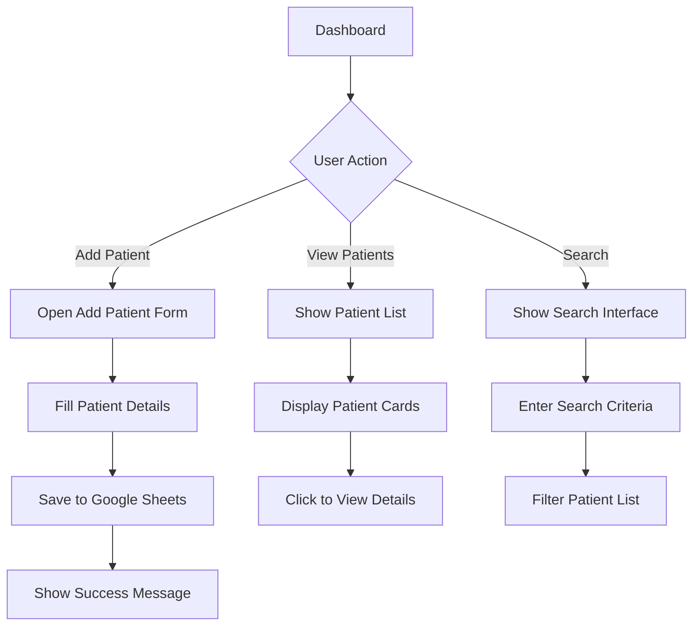
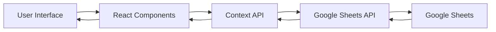

# Patient Management System

A modern web application for managing patient records using React, Material-UI, and Google Sheets API.

## Features

- 📝 Add new patient records
- 📋 View patient details
- 🔍 Search and filter patients
- 📊 Store data in Google Sheets
- 🔐 Secure authentication with Google OAuth
- 📱 Responsive design for all devices

## Tech Stack

- **Frontend**: React.js, Material-UI
- **Authentication**: Google OAuth
- **Data Storage**: Google Sheets API
- **State Management**: React Context API
- **Testing**: Jest, React Testing Library

## User Flow

### 1. Authentication Flow



### 2. Patient Management Flow



### 3. Data Flow



## Getting Started

### Prerequisites

- Node.js (v14 or higher)
- npm or yarn
- Google Cloud Platform account
- Google Sheets API enabled

### Installation

1. Clone the repository:

```bash
git clone https://github.com/VikashSindhania/Patient-Management.git
cd Patient-Management
```

2. Install dependencies:

```bash
npm install
# or
yarn install
```

3. Set up environment variables:

   - Copy `.env.example` to `.env`
   - Fill in your Google OAuth credentials and other configuration

4. Start the development server:

```bash
npm start
# or
yarn start
```

## Environment Variables

Create a `.env` file in the root directory with the following variables:

```env
REACT_APP_GOOGLE_CLIENT_ID=your_client_id_here
REACT_APP_GOOGLE_CLIENT_SECRET=your_client_secret_here
REACT_APP_GOOGLE_REDIRECT_URI=http://localhost:3000/auth/callback
REACT_APP_SPREADSHEET_ID=your_spreadsheet_id_here
REACT_APP_SHEET_NAME=your_sheet_name_here
```

## Project Structure

```
patient-management/
├── public/
├── src/
│   ├── components/
│   │   ├── patient/
│   │   └── common/
│   ├── services/
│   ├── context/
│   ├── utils/
│   └── App.js
├── .env.example
├── package.json
└── README.md
```

## Contributing

1. Fork the repository
2. Create your feature branch (`git checkout -b feature/AmazingFeature`)
3. Commit your changes (`git commit -m 'Add some AmazingFeature'`)
4. Push to the branch (`git push origin feature/AmazingFeature`)
5. Open a Pull Request

## License

This project is licensed under the MIT License - see the [LICENSE](LICENSE) file for details.

## Acknowledgments

- Material-UI for the beautiful components
- Google Sheets API for data storage
- React community for amazing tools and libraries

## Contact

Vikash Sindhania - [GitHub](https://github.com/VikashSindhania)

Project Link: [https://github.com/VikashSindhania/Patient-Management](https://github.com/VikashSindhania/Patient-Management)
